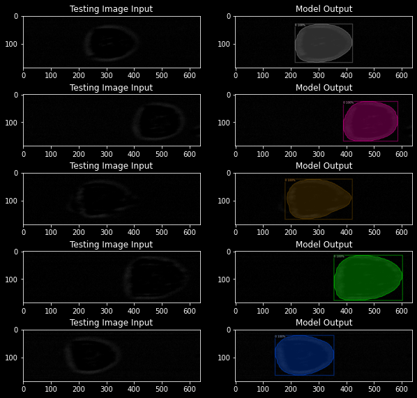

# RTDCSegmentation
This is a repository for segmenting suspended cells.

## Running the Model
An example python script that minimally loads the model is called "evaluateSegmentation.py".



## Installation

Install Detectron2 from source as outlined [here](https://detectron2.readthedocs.io/en/latest/tutorials/install.html). Ensure that Pytorch can access your GPU. There are no other dependencies for this project at this time. 

## Structure

Only the code is uploaded to Github. Final model weights and data are available upon request. 

Multiple experiments are concatenated for calibrating the final model. Annotation data is in COCO format and can easily be accessed from detectron 2. 
```
├── data
│   ├── allCells
│   │   ├── annotations
│   │   └── images
│   ├── experiment1
│   │   ├── annotations
│   │   └── images
├── output
│   ├── segmentCells
└── scripts
```


